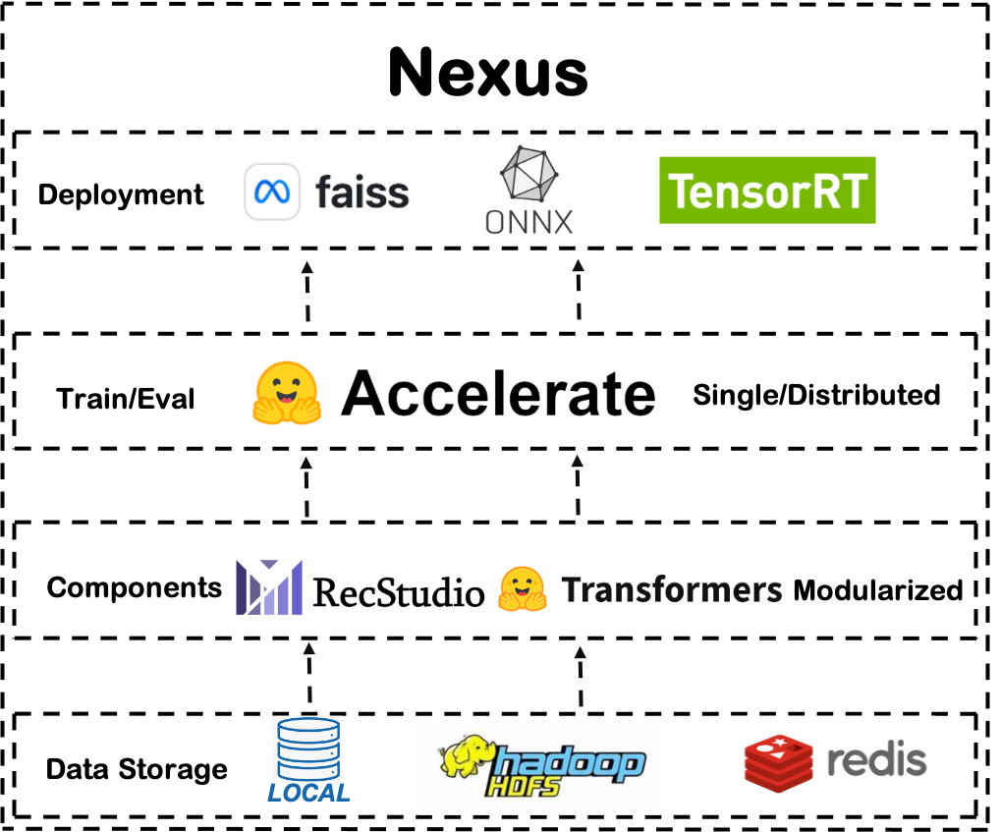

# Nexus

Nexus is the first [Pytorch](https://pytorch.org/)-based information retrieval development toolkit aimed at industrial internet applications such as recommendation system and document retrieval. It inherits the modular design concept of [RecStudio](https://github.com/USTCLLM/RecStudio), aiming to help algorithm engineers quickly experiment with various modules by modularizing various machine learning models. Additionally, it adds industry-friendly features beyond RecStudio, supporting the rapid construction and deployment of industrial internet information retrieval systems. 

## Key Industry Features
The key industry features are as follows:

- It supports reading data from local and distributed file systems, such as HDFS. Unlike the small-batch datasets used in academia, industrial-level data is often very large and needs to be stored daily in the HDFS distributed file system. Therefore, Nexus provides HDFS data reading interfaces to facilitate rapid integration with industrial scenario data. But it still supports reading data from local files for debugging.

- It supports various training configurations including single-machine single-card, single-machine multi-card, and distributed multi-machine multi-card training for the engineer's diverse devlopment needs. The huge amount of industrial data often demands higher training time, so Nexus offers distributed training interfaces to facilitate rapid distributed training of industrial machine learning models. What's more, we utilize the [Accelerate](https://huggingface.co/docs/transformers/accelerate) to wrap the training process. It allows the engineer to switch between training and debugging by modifying a fews lines of code. 

- It supports easily deploying information retrieval models into the industrial internet and severing the customer's request. Nexus contains a high performance inference engine to satisfy the requirements online request's latency. The inference engine compresses the data using [Protocol Buffers](https://github.com/protocolbuffers/protobuf) firstly. It then stores the compressed data into the key-value database [Redis](https://redis.io/). And finally, [ONNX](https://onnx.ai/), [TensorRT](https://github.com/NVIDIA/TensorRT), and [Faiss](https://github.com/facebookresearch/faiss) are integrated into the inference engine to speed up the inference process.

## Tutorial
The following tutorials provide detailed introduction on training, evaluation, and deploying [recommendation](./examples/recommendation/tutorial.ipynb) or [textual](./examples/text_retrieval/tutorial.ipynb) models using Nexus.